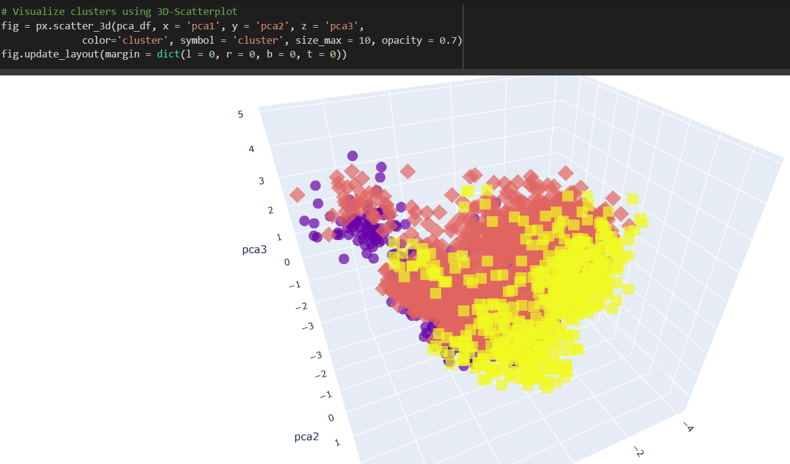

# ML for Market Segmentation

This is a project to adopt K-Means, CPA and Autoenconder to train the model for segmenting the market based on previous sales data.
After the model was trained, use 3D-Scatterplot from Plotly to visualize the clusters of data points.

